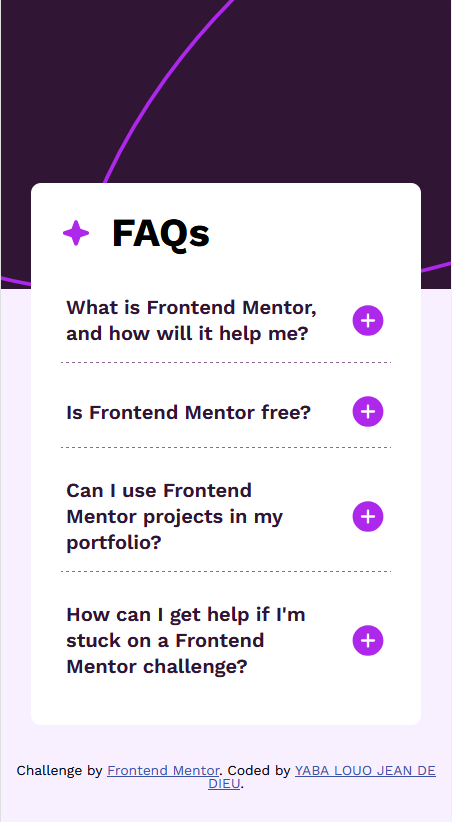
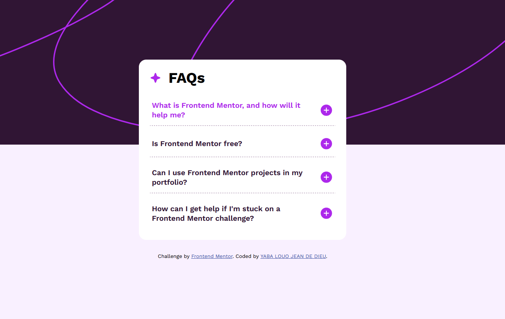

# Frontend Mentor - FAQ accordion solution

This is a solution to the [FAQ accordion challenge on Frontend Mentor](https://www.frontendmentor.io/challenges/faq-accordion-wyfFdeBwBz). Frontend Mentor challenges help you improve your coding skills by building realistic projects. 

## Table of contents

- [Overview](#overview)
  - [The challenge](#the-challenge)
  - [Screenshot](#screenshot)
  - [Links](#links)
- [My process](#my-process)
  - [Built with](#built-with)
  - [What I learned](#what-i-learned)
- [Author](#author)

## Overview

### The challenge

Users should be able to:

- Hide/Show the answer to a question when the question is clicked
- Navigate the questions and hide/show answers using keyboard navigation alone
- View the optimal layout for the interface depending on their device's screen size
- See hover and focus states for all interactive elements on the page

### Screenshot




### Links

- Solution URL: [https://github.com/victoire20/faq-accordion](https://github.com/victoire20/faq-accordion)
- Live Site URL: [https://faq-accordion-frontend-mentor-challen.netlify.app](https://faq-accordion-frontend-mentor-challen.netlify.app)

## My process

### Built with

- Semantic HTML5 markup
- CSS custom properties
- Flexbox
- CSS Grid
- Mobile-first workflow

### What I learned

I've learned how to use Grid better—and, most importantly, how to add effects to it! This has helped me understand what goes on behind the scenes in CSS frameworks, and I think it's fun 😊

To see how you can add code snippets, see below:

```html
<div id="collapseThree" class="accordion-collapse collapse" data-bs-parent="#accordionExample">
  <div class="accordion-body">
    Yes, you can use projects completed on Frontend Mentor in your portfolio. It's an excellent
    way to showcase your skills to potential employers!
  </div>
</div>
```
```css
.accordion-collapse {
  font-size: .8rem;
  color: var(--purple-600);
  line-height: 1.5;

  display: grid;
  grid-template-rows: 0fr;
  opacity: 0;
  transition:
          grid-template-rows 300ms ease,
          opacity 200ms ease,
          transform 300ms ease;
}
```
```js
const accordionButtons = document.querySelectorAll('.accordion-button')

const restartIconAnimation = (button) => {
  button.classList.remove('accordion-button-rotate')
  void button.offsetWidth
  button.classList.add('accordion-button-rotate')
}

accordionButtons.forEach(btn => {
  const targetSelector = btn.getAttribute('data-bs-target')
  const targetCollapse = document.querySelector(targetSelector)

  const isOpenInitial = targetCollapse.classList.contains('show').toString()
  btn.setAttribute('aria-expanded', isOpenInitial)

  btn.addEventListener('click', () => {
    const targetSelector = btn.getAttribute('data-bs-target')
    const targetCollapse = document.querySelector(targetSelector)

    const isAlreadyOpen = targetCollapse.classList.contains('show')

    document.querySelectorAll('.accordion-collapse').forEach(collapse => {
      collapse.classList.remove('show')
    });

    accordionButtons.forEach(button => {
      button.setAttribute('aria-expanded', 'false')
    })

    if (!isAlreadyOpen) {
      targetCollapse.classList.add('show')
      btn.setAttribute('aria-expanded', 'true')
    }

    restartIconAnimation(btn)
  })
})
```

## Author

- Website - [https://portfolio-eight-dun-30.vercel.app](https://portfolio-eight-dun-30.vercel.app)
- Frontend Mentor - [@victoire20](https://www.frontendmentor.io/profile/victoire20)
